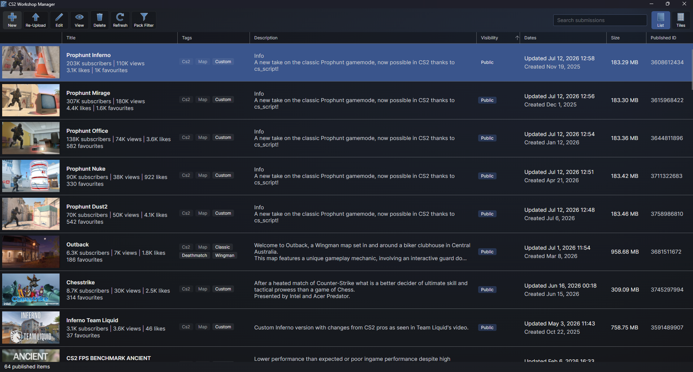

# CS2 Workshop Manager

External Counter-Strike 2 Workshop Manager, it packs a compiled addon the same way Valve's tool does and publishes it to the Steam Workshop, then lets you manage everything you have published, from a desktop app or from the command line.



It comes in three parts:

- **GUI**, a desktop app for Windows and Linux.
- **CLI**, a command line tool for scripts and build pipelines.
- **CS2WorkshopManager**, the library both are built on, published on NuGet for your own tools.

## Why

Valve's workshop manager only runs inside the game's tools, needs the addon open in Hammer, and has its share of rough edges, such as truncating descriptions when you re-upload. This one does the same job outside the tools, matches the original's packing logic file for file, and adds what the original lacks: a list of your published items with their statistics, editing an item's info without re-uploading its files, a description editor that previews Steam's formatting, and control over which files go into the upload.

## Requirements

- Counter-Strike 2 installed through Steam, with the addon compiled under `game/csgo_addons/<addon>`.
- Steam running and logged into the account that owns the workshop items.
- Windows or Linux. Releases are self-contained and need no .NET install.

Building from source needs the .NET 10 SDK.

## The desktop app

The main window lists every workshop item the logged in account has published for Counter-Strike 2, as a list or as tiles, with subscriber, view, like and favourite counts, tags, visibility and dates. A search box narrows the list by title, tags, description or workshop ID.

From there you can:

- **New**: publish an addon as a new workshop item.
- **Re-Upload**: upload an addon's files again to an existing item, with a change note.
- **Edit**: change an item's title, description, thumbnail, visibility or game modes without uploading files. Only what you change is sent.
- **View**: open the item's workshop page in your browser.
- **Delete**: remove the item from the workshop, after confirmation.
- **Pack Filter**: see every file under an addon as a tree, ticked when the upload takes it, and tick or untick files and folders to change that.

The publish form shows the same asset type graph as Valve's tool, so you can see what the upload is made of before sending it. The description editor has formatting buttons for Steam's markup and a preview that renders it the way the workshop page will, pictures included. When the tools are running, the addon they have open is chosen for you.

## The command line tool

```
CS2WorkshopManager-CLI upload --addon prophunt --title "Prophunt Mirage" --visibility unlisted
CS2WorkshopManager-CLI upload --addon prophunt --title "Prophunt Mirage" --id 3611562098 --changenote "Fixed the lighting"
CS2WorkshopManager-CLI edit --id 3611562098 --description_file description.txt
CS2WorkshopManager-CLI list
```

| Command | What it does |
|---|---|
| `upload` | Packs an addon and publishes it as a new item, or updates an existing item when `--id` is given. |
| `edit` | Changes a published item's title, description, thumbnail, visibility or game modes. |
| `list` | Lists your published items with their counts. |
| `view` | Opens an item's workshop page in the browser. |
| `delete` | Deletes an item, after asking, or straight away with `--yes`. |
| `addons` | Lists the addon folders, marking the one open in the tools. |
| `contents` | Shows what an addon would upload by asset type. |
| `files` | Lists the files an addon would upload, or every file with `--all`. |
| `rules` | Lists, adds and removes an addon's packing rules. |

Every command has `--help`. The game is found through Steam, or pass `--game` with the install folder. `upload --stage_only` packs the addon into `game/csgo_addons/vpks/<id>` without talking to Steam, which is useful for checking what would be sent.

## Packing rules

The upload takes the files that `gameinfo.gi` lists under `VpkDirectories`, minus the files the workshop manager always leaves out, exactly as Valve's tool does. On top of that you can keep files out or bring files in with rules of your own, saved as `publish_rules.txt` in the addon's content folder, `content/csgo_addons/<addon>`:

```
"publish_rules"
{
	"exclude"	"materials/dev/"
	"include"	"maps/backup.txt"
}
```

A rule matches everything whose path starts with its text, a folder ending in a slash. The first matching rule wins, and your rules are checked before gameinfo's. The Pack Filter window and the `rules` command both write this file, and you can edit it by hand.

## The library

The `CS2WorkshopManager` package wraps all of this for your own tools. It talks to the running Steam client directly, so it needs no Steamworks SDK or `steam_api` library alongside it.

```csharp
var manager = WorkshopManager.FromSteamInstall();

var result = await manager.PublishAsync(new AddonPublishOptions
{
    AddonName = "prophunt",
    Title = "Prophunt Mirage",
    Visibility = WorkshopVisibility.Unlisted,
    Tags = ["CS2", "Map", "Custom"],
});

Console.WriteLine(result.Url);

await foreach (var item in WorkshopManager.GetPublishedItemsAsync())
{
    Console.WriteLine($"{item.Title}: {item.Subscribers} subscribers");
}
```

## Building

```
dotnet build CS2WorkshopManager.slnx -c Release
```

The GUI publishes as a single self-contained executable and the CLI as a native AOT executable:

```
dotnet publish GUI/GUI.csproj -c Release -r win-x64
dotnet publish CLI/CLI.csproj -c Release -r win-x64
```

Use `linux-x64` for Linux. Native AOT cannot cross compile, so each platform builds on its own machine, which is what the CI does.

## Layout

| Folder | What is in it |
|---|---|
| `CS2WorkshopManager` | The library: packing, rules, asset types and publishing. |
| `Steamworks` | A minimal Steamworks binding that talks to the running Steam client. |
| `GUI` | The Avalonia desktop app. |
| `CLI` | The command line tool. |

## Credits

The file type icons in the Pack Filter window are from [Source 2 Viewer](https://github.com/ValveResourceFormat/ValveResourceFormat), see `THIRD_PARTY_NOTICES.txt`.

This project is not affiliated with Valve. Counter-Strike and Steam are trademarks of Valve Corporation.

## License

MIT, see `LICENSE`.
